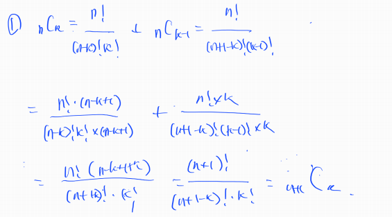
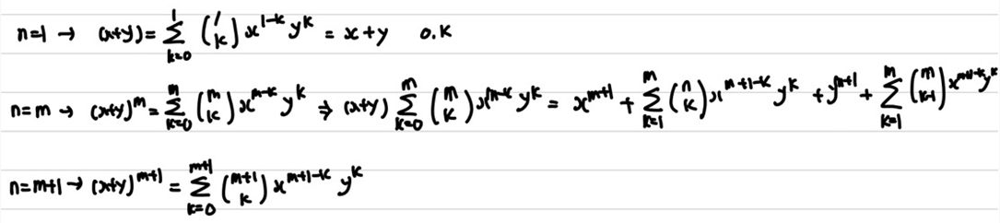
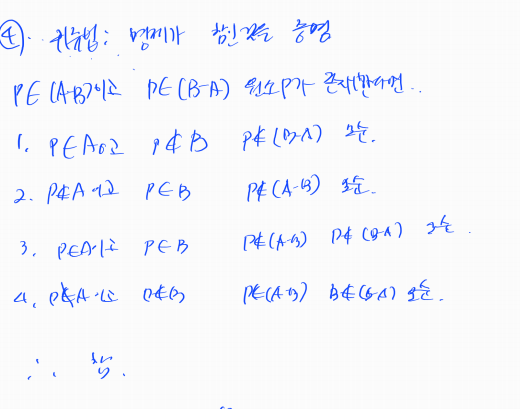

## 1. 논리와 증명

```
문제 1 다음 명제들이 항진 명제라는 것을 진리표를 이용해서 보이시오.
```

| p    | q    | ~p   | ~p^q | ~(~p^q) | ~(~p^q)vq |
| ---- | ---- | ---- | ---- | ------- | --------- |
| T    | T    | F    | F    | T       | T         |
| T    | F    | F    | F    | T       | T         |
| F    | T    | T    | T    | F       | T         |
| F    | F    | T    | F    | T       | T         |

```
문제 2 다음 명제들이 모순 명제라는 것을 진리표를 이용해서 보이시오.
```

| p    | q    | ~p   | ~pvq | ~q   | p^~q | (~pvq)^(p^~q) |
| ---- | ---- | ---- | ---- | ---- | ---- | ------------- |
| T    | T    | F    | T    | F    | F    | F             |
| T    | F    | F    | F    | T    | T    | F             |
| F    | T    | T    | T    | F    | F    | F             |
| F    | F    | T    | T    | T    | F    | F             |

```
문제 3 다음 명제의 쌍 들에 대해서 두 명제가 동등한지를 진리표를 이용해 확인하시오.
```

| p    | q    | pvq  | p^(pvq) |
| ---- | ---- | ---- | ------- |
| T    | T    | T    | T       |
| T    | F    | T    | T       |
| F    | T    | T    | F       |
| F    | F    | F    | F       |

```
문제 4 명제식의 변형을 통하여 다음 명제를 간소화하시오.
```

| p    | q    | ~q   | p^~q | p^q  | (p^~q)v(p^q) |
| ---- | ---- | ---- | ---- | ---- | ------------ |
| T    | T    | F    | F    | T    | T            |
| T    | F    | T    | T    | F    | T            |
| F    | T    | F    | F    | F    | F            |
| F    | F    | T    | F    | F    | F            |

```
문제 5 다음 명제들이 참인지 확인하시오. 단, R은 실수의 집합을 의미하고, Z는 정수의 집합을 의미한다. 
1. 거짓 
	x가 0과 1사이의 값일 경우 제곱 값이 더 작음
3. 참
	x가 0과 1사이의 값일 경우 제곱 값이 더 작음
```

```
문제 6 n이 짝수이면 3n+5는 홀수임을 증명하라.
n = 2k
6k +5 = 2(3k + 2) + 1 
=> 2로 묶었을 때 1이 남음 따라서 홀수
```

```
문제 8 m이 짝수이고 n이 홀수이면 2m + 3n은 홀수임을 증명하라.
```

```
m = 2k
n = 2k + 1

2(2k) + 3(2k+1) = 4k + 6k + 3 = 10k + 3
= 2(5k + 1) + 1
=> 2로 묶었을 때 1이 남으므로 홀수
```

```
문제 10 n^2이 짝수이면 n은 짝수임을 증명하라.
```

```
대우가 참이면 명제가 참
대우 : n이 홀수면 n^2은 홀수

n = 2k + 1
n^2 = (2k + 1)^2 = 4(k^2 + k) + 1

n이 홀수일 때 n제곱도 홀수
따라서 명제도 참
```

```
문제 12 n^2이 3의 배수이면 n은 3의 배수임을 증명하라.
```

```
대우 : n이 3의 배수가 아니면 n^2은 3의 배수가 아님

3의 배수가 아닌 경우 2가지
1. n = 3k + 1
2. n = 3k + 2

1. n = 3k + 1일 때
n^2 = 9k^2 + 6k + 1 = 3(3k^2 + 2k) + 1 => 3의 배수가 아님

2. n = 3k + 2일 때
n^2 = 9k^2 + 12k + 4 = 3(3k^2 + 4k + 1) + 1 => 3의 배수가 아님

n이 3의 배수가 아닌 경우 n제곱도 모두 3의 배수가 아님
따라서 명제도 참
```


# 수와표현

------

### 문제1 2진수 표현에서 logn 비트로 표현할 수 있는 숫자 범위는?

0 ≤ x ≤ 2^log(n-1)

n-1 까지의 수를 표현할 수 있다.

------

### 문제3: n이 충분히 큰 값일 때 다음 중 어느 값이 더 큰가? 각 쌍에 대해 비교하고 이유를 작성하시오.


------

### 문제3: n이 충분히 큰 값일 때 다음 중 어느 값이 더 큰가? 각 쌍에 대해 비교하고 이유를 작성하시오.

```python
1)      2n     (   )  n^2
	=>   log2n         2logn
	=> log2 + logn    logn + logn
  =>   log2           logn
  if n > 2
  =>   log2      <    logn
  따라서 2n      <     n^2 

3)   2^nlogn   (   )   n!  
  => log2^nlogn       logn!
	=> nlogn          logn!
	=> logn^n         logn!
  => logn*n*n..*n   logn*(n-1)*(n-2)*...*1
	=> n*n*...n   >   (n-1)*(n-2)*...*1
  따라서 2^nlogn   >   n!  
```

------

### 문제4

x = logyz /loga = (logy + logz)/ loga


------

### 문제5. 다음 함수들의 역함수를 구하시오.

f(x) = log(x-3) - 5

역함수

x = log(y-3) - 5 x + 5 = log(y-3) 2^(x+5) = y-3

역함수 y = 2^(x+5) + 3


# 집합과 조합론

------

### 문제1



------

### 문제2



------

### 문제4



------

### 문제8

62C2 = 64*63/2 = 2016

------

### 문제12

1. 52개가 전부 다 다른 카드라면: 52C5 = 2,598,960
2. 52개 중 서로 같은 카드가 있다면: 정보 부족으로 풀 수 없음.

ex) 2만 두 장 있다면: 50C5 + 50C4 + 50C3

------

### 문제16

1. 52개가 전부 다 다른 카드라면: 52C5
2. 52개 중 서로 같은 카드가 있다면: 정보 부족으로 풀 수 없음.

ex) 2만 두 장 있다면: 50C5 + 50C4

1. 트럼프 카드라면: 13C5x4^5 = 1,317,888

